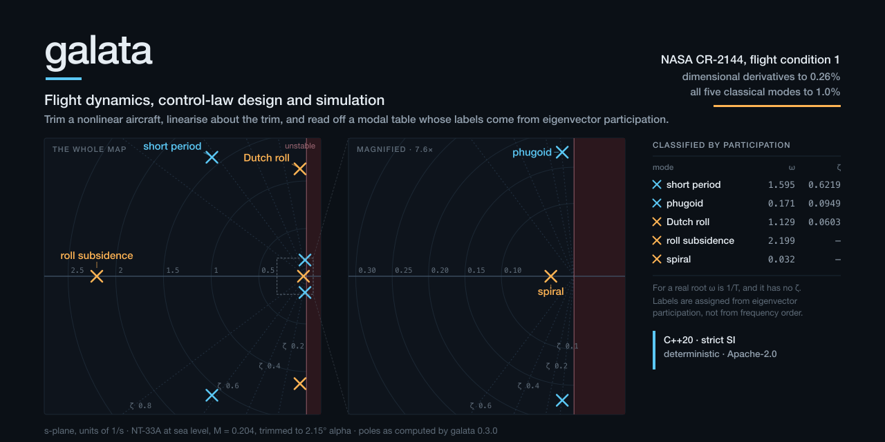

# galata

Flight dynamics, control-law design and simulation — reproducibly, from a file
you can read, with every number traceable to the routine that produced it.

galata is an **offline engineering workbench**. A YAML study can trim and
linearise a local aircraft model, design continuous LQR state feedback, analyse
the closed loop, simulate linear and nonlinear responses with explicit actuator
limits, and write Markdown, HTML and CSV reports with a run manifest.

The analysis includes labelled aircraft modes, frequency response, gain, phase,
delay and disk margins, and Hamiltonian H-infinity norm brackets for stable
systems. Published-reference comparisons and numerical checks are recorded
separately in the [verification report](docs/VERIFICATION.md).

It is usable for supervised, offline aviation and defence engineering studies
within these limits. It is **not a qualified tool, an onboard controller, or a
validated model of an arbitrary aircraft**. The [operating guide](docs/WORKBENCH.md)
explains the supported workflow and the checks a result still needs.

An experimental [continuous block-model profile](docs/MODEL_FILES.md) now supports
headless compilation and simulation of scalar feedback diagrams. The
[working example](examples/continuous-feedback/README.md) records model identity
and scoped run evidence. The
[M2 preview increment](docs/product/M2_IMPLEMENTATION.md) adds immutable project
revisions, an isolated CLI worker and an optional native macOS editor and result
viewer with a Dim theme, keyboard-accessible block/sample tables and saved-revision
review and restore. A typed linear-system/LQR adapter imports the existing NT-33A
study with its original source evidence. Full M2 acceptance and desktop toolkit selection remain
open; delivery continues macOS first, then Linux.

C++20 core, strict SI units, deterministic by policy, Apache-2.0.

[](https://github.com/celikgo/galata/actions/workflows/ci.yml)
[](docs/adr/0004-determinism-policy.md)



<sub>Drawn from a run, not by hand: `tools/social/` emits the poles, CI diffs
them, and the labels are the classifier's own output.</sub>

---

## The claim, and how to check it in one command

Everything below is produced by
[`tests/validation/`](tests/validation/) and regenerated into
[`docs/VERIFICATION.md`](docs/VERIFICATION.md), which CI diffs. The input is a
set of **non-dimensional** derivatives and some geometry — there is no matrix
anywhere in it.

**The aircraft.** NT-33A, a variable-stability T-33. **The condition.** Flight
condition 1 of eight, Table II-2: sea level, M = 0.204, power approach, bare
airframe. **The reference.** Robert K. Heffley and Wayne F. Jewell, *Aircraft
Handling Qualities Data*, NASA CR-2144, Systems Technology Inc., December 1972.
NTRS 19730003312, distribution unlimited.

### Dimensional derivatives, against Table II-7

Seven numbers the report computed from the same non-dimensional set by a
different route.

| Derivative | galata | published | deviation |
|---|---|---|---|
| Y_v | −0.124902 | −0.125 | 0.08% |
| L_beta' | −5.49695 | −5.49 | 0.13% |
| N_beta' | +0.667796 | +0.667 | 0.12% |
| L_p' | −2.03530 | −2.03 | **0.26%** |
| N_p' | −0.115922 | −0.116 | 0.07% |
| L_r' | +0.64184 | +0.641 | 0.13% |
| N_r' | −0.207034 | −0.207 | 0.02% |

The source prints its inputs and outputs to three significant figures, so each
value carries up to about 0.5% of its own rounding and several combine in every
one of these. **The gate is 0.5%. The worst observed is 0.26%.**

### All five classical modes, against Tables II-4 and II-8

| Mode | galata | published | deviation |
|---|---|---|---|
| Phugoid | ζ 0.094852, ωₙ 0.1714 | 0.0948, 0.172 | 0.05%, 0.35% |
| Short period | ζ 0.62193, ωₙ 1.5950 | 0.622, 1.59 | 0.01%, 0.32% |
| Dutch roll | ζ 0.060259, ωₙ 1.1293 | 0.0609, 1.13 | **1.05%**, 0.06% |
| Roll subsidence | 1/T 2.1992 | 2.20 | 0.04% |
| Spiral | 1/T 0.031902 | 0.0318 | 0.32% |

The report prints no headings saying "short period" or "Dutch roll" — the modal
characteristics *are* the factored denominators of its transfer-function tables,
and Appendix A prints this exact condition's lateral denominator as its worked
example. galata's labels come from eigenvector participation and are checked
against that identification.

### Reproduce both tables

```bash
git clone https://github.com/celikgo/galata.git
cd galata
export VCPKG_ROOT=/path/to/vcpkg          # manifest mode fetches the rest

cmake --preset dev
cmake --build --preset dev

ctest --preset dev -L validation          # fails if any deviation above exceeds its gate
./build/dev/src/cli/galata run examples/nt33a-trim-and-linearise/study.yaml --output-dir build/trim-study
```

The tier carries the ctest **label** `validation`, so `-L` is the flag.

### Or look at the whole case on one page

[**The NT-33A at flight condition 1**](https://celikgo.github.io/galata/reports/nt33a-fc1.html)
— trim point, the labelled modal table with its participation factors, the pole map, the Bode
plot with every crossover marked, and a Nyquist against the disk the loop must avoid. One
self-contained page, no JavaScript and no network requests, with a light variant that is also
what it prints as. The committed copy is
[`docs/reports/nt33a-fc1.html`](docs/reports/nt33a-fc1.html), and it opens from disk.

Every number and every mark on it comes from a run: `tools/report/` emits the run record,
`scripts/gen-report-page.py` draws the page from it, and CI compares the record numerically
against the code and the page byte for byte against the record. The page names the routine that
produced each figure.

### What does NOT reproduce

One published quantity does not, and it stays published rather than being
quietly dropped: a state matrix assembled **by hand** from the report's
*dimensional* derivatives gives a phugoid damping ratio 2.04% below the
published value, while the full chain above reproduces it to 0.05%. The cause is
now localised to a single matrix entry — a gravity term that the substituted-ẇ
form of the report's Appendix C manufactures and that cannot physically exist.
The investigation, including what was ruled out, is in
[`docs/notes/phugoid-damping.md`](docs/notes/phugoid-damping.md); a labelled
regression lock holds the gap at its measured size meanwhile.

---

## Status: 0.3.0 — bounded offline workbench

For the macOS desktop candidate, see the [packaging and verification
guide](docs/desktop-packaging.md). The candidate is locally sealed and checked;
Developer ID signing, notarization and full desktop acceptance remain open.

The trim, linearisation and frequency-analysis workflow now connects to control
synthesis and time-domain simulation. This is a usable CLI and C++ library
release with a deliberately limited model and controller scope. It does not
complete the broader desktop, hardware or v1.0 plans in the
[roadmap](docs/ROADMAP.md).

| Surface | State |
|---|---|
| CLI, strict YAML inputs, contained report outputs and input-snapshot manifests | implemented; integration-tested |
| Installable C++20 libraries and CMake package | implemented; installed-consumer check |
| Frames, ISA atmosphere, fixed-step RK4 and general-inertia rigid-body dynamics | implemented; see the V&V report for evidence and scope |
| Local derivative aircraft, straight-line trim, finite-difference linearisation and mode classification | implemented; published NT-33A flight-condition comparison |
| Frequency response and sampled margins, sensitivity and principal gains | implemented; reference comparisons retain their frequency-search limitations |
| CARE, continuous LQR, explicit-gain filtered PID and linear interconnections | implemented; solver evidence and controller assumptions reported separately |
| Hamiltonian H-infinity, S/T norm and SISO disk-size brackets | implemented; analytic checks, numerical reliability limits, no interval proof |
| Linear and local nonlinear simulation, with four bounded first-order actuators | implemented; analytic and convergence tests, no flight-test validation |
| Markdown and self-contained HTML tables, trajectory CSV and run provenance | implemented; integration-tested |
| Continuous scalar/linear project drafts, retained revision review/restore and isolated CLI jobs | experimental M2 preview; local verification record in the implementation guide |
| Native macOS block editor, block/sample tables, trajectory plot and evidence viewer | optional Dim-themed feasibility preview; full desktop and installation acceptance pending |
| Typed linear-system/LQR graph adapter and NT-33A study import | experimental; retains original diagnostics, no new aircraft validation |
| Plugin ABI, hardware interfaces and onboard deployment | not implemented |

The table above is maintained by hand and checked in review. The capability
table below is not: it is generated from the registry the CLI dispatches
through, by `scripts/gen-status-table.sh`, and CI fails if the committed copy
disagrees. Run `galata capabilities` to get the same list from your own build.

### Capabilities in this build

<!-- BEGIN GENERATED CAPABILITY TABLE -->
| Capability | What it does | Produces | State |
|---|---|---|---|
| `analyze.diskmargin` | Disk margin of one loop — robustness to simultaneous gain and phase variation — with estimated gain and phase ranges and a candidate boundary perturbation | `disk_margin` | implemented and validated |
| `analyze.freqresp` | Frequency response of one loop of a linear model, evaluated by Hessenberg solves with the grid refined around the system's own lightly damped modes | `frequency_response` | implemented and validated |
| `analyze.hinfnorm` | Bound a stable continuous-time H-infinity norm using Hamiltonian level tests | `hinfinity_norm` | implemented, unvalidated |
| `analyze.margins` | Gain, phase and delay margins of one loop, with every crossover reported and the frequency at which each occurs | `stability_margins` | implemented and validated |
| `analyze.modes` | Eigenvalues, modal metrics and participation factors, with the classical aircraft modes classified by participation | `modal_table` | implemented and validated |
| `analyze.robust_bounds` | Bound S/T norms and SISO disk size for an internally stable feedback loop | `robust_bounds` | implemented, unvalidated |
| `analyze.sensitivity` | Sensitivity and complementary sensitivity peaks M_S and M_T of a loop closed with negative unit feedback, and the frequencies at which they occur | `sensitivity_peaks` | implemented and validated |
| `analyze.sigma` | Singular values of a MIMO transfer matrix over frequency — the principal gains, their spread, and the peak gain | `singular_values` | implemented and validated |
| `data.import.csv` | Read a measured record from delimited text under a declared unit, frame and timebase mapping, refusing anything the study has not accounted for | `measured_record` | implemented, unvalidated |
| `identify.static_fit` | Fit a response that is linear in declared terms — a bench map — reporting the range it was measured over and an uncertainty only where the data supports one | `static_fit` | implemented, unvalidated |
| `linearize.extended` | Linearise a multirotor about a hover trim on a local attitude-error chart, with named wind disturbance columns and a declared observation model | `linear_system` | implemented, unvalidated |
| `linearize.finitediff` | Linearise about a trim point by central differences, with a Richardson truncation-error estimate per entry | `linear_system` | implemented and validated |
| `model.aircraft.derivatives` | Load a nonlinear aircraft model built from a non-dimensional derivative set | `aircraft` | implemented and validated |
| `model.channels` | Select named inputs and outputs while retaining all internal states | `linear_system` | implemented, unvalidated |
| `model.compile` | Compile supported continuous model profiles with typed ports and explicit feedback semantics | `executable_model` | implemented, unvalidated |
| `model.control_system` | Extract the closed loop or plant-input return ratio of an LQR design | `linear_system` | implemented, unvalidated |
| `model.feedback` | Close a square state-space loop with negative identity feedback | `linear_system` | implemented, unvalidated |
| `model.linear.export` | Write a linear model as the named-matrix YAML that model.linear.statespace reads | `linear_system` | implemented, unvalidated |
| `model.linear.statespace` | Load a linear state-space model (A, B, state and input names) from a YAML file | `linear_system` | implemented, unvalidated |
| `model.linear_graph` | Lower a typed linear system or LQR plant and feedback into an executable graph with origin evidence | `executable_model` | implemented, unvalidated |
| `model.quadrotor` | Load a nonlinear multirotor plant — rotors with first-order speed lag, per-axis drag and an optional battery | `quadrotor` | implemented, unvalidated |
| `model.series` | Cascade two state-space systems in declared channel order | `linear_system` | implemented, unvalidated |
| `report.csv` | Export a computed linear or nonlinear time history with named columns | `report` | implemented, unvalidated |
| `report.html` | Write a self-contained HTML report with readable tables and no remote resources | `report` | implemented, unvalidated |
| `report.markdown` | Write a Markdown report from upstream results | `report` | implemented, unvalidated |
| `sim.linear` | Integrate a continuous linear model with a constant input and fixed-step RK4 | `linear_trajectory` | implemented, unvalidated |
| `sim.model` | Run a compiled continuous model with fixed-step RK4 and write CSV plus scoped evidence | `model_trajectory` | implemented, unvalidated |
| `sim.nonlinear` | Simulate a local aircraft model with bounded actuators and optional full-state feedback | `nonlinear_trajectory` | implemented, unvalidated |
| `sim.plant` | Integrate a nonlinear plant model with fixed-step RK4 from a declared state or a trim, carrying its appended rotor and battery states | `plant_trajectory` | implemented, unvalidated |
| `synth.care` | Solve a continuous-time algebraic Riccati equation with residual and stability checks | `care_solution` | implemented and validated |
| `synth.lqr` | Design continuous full-state feedback and retain the weights and numerical evidence | `control_law` | implemented, unvalidated |
| `synth.pid` | Realise explicitly supplied PID gains with a mandatory derivative filter | `linear_system` | implemented, unvalidated |
| `trim.hover` | Solve multirotor equilibrium — still-air hover, hover in a crosswind, or cruise as a relative equilibrium — for attitude and rotor speeds, reporting each rotor's margin | `hover_trim` | implemented, unvalidated |
| `trim.level` | Solve straight-line trim — wings level, no sideslip — for angle of attack, elevator and thrust, by Newton on a square residual | `trim_point` | implemented and validated |
<!-- END GENERATED CAPABILITY TABLE -->

*implemented and validated* means the output has been compared against a
published reference; see [`docs/VERIFICATION.md`](docs/VERIFICATION.md).
*implemented, unvalidated* means it works and is tested, but no published
reference has been compared against.

## Scope and limitations

- **No qualification or airworthiness claim.** The repository provides no tool
  qualification package or approved certification evidence. Using a result in
  an assurance process requires application-specific review and independently
  established evidence.
- **Local aircraft dynamics.** The derivative model has no stall, Mach schedule,
  engine map, structural flexibility or validated full flight envelope. The
  nonlinear driver stops outside its advisory angle-of-attack/Mach guards;
  staying inside them does not establish model validity.
- **Continuous control studies.** LQR assumes exact state feedback. PID accepts
  supplied gains; it does not tune them. Sensors, sampled control, estimator
  design and flight-code generation are outside this release.
- **Bounded desktop preview.** The optional macOS editor uses the synthetic
  continuous scalar profile. Aircraft block adaptation, a supported installer,
  complete accessibility acceptance, 3-D views and hardware links remain open.

The [operating guide](docs/WORKBENCH.md) distinguishes numerical convergence,
published-reference agreement and aircraft-specific validation.

## Who it is for

Flight-control and GNC engineers, controls researchers, students and autopilot
developers conducting supervised offline studies. Aviation or defence use is
bounded by the same model, numerical and assurance limits; an industry label
does not extend the evidence supplied with the tool.

## Quickstart

Build the library and CLI, run the tests, then execute the complete local
control-design study:

```bash
git clone https://github.com/celikgo/galata.git
cd galata

# vcpkg in manifest mode fetches Eigen, yaml-cpp and GoogleTest.
export VCPKG_ROOT=/path/to/vcpkg

cmake --preset dev
cmake --build --preset dev
ctest --preset dev

# Trim, design, analyse, simulate, and write reports into a separate directory.
./build/dev/src/cli/galata run examples/nt33a-control-design/study.yaml --output-dir build/control-study
```

The output includes control-design Markdown and HTML reports, linear and
nonlinear trajectory CSV files, and a content-addressed run manifest. Existing
reports require an explicit `--overwrite`. The example's controller costs and
actuator limits are illustrative inputs, not NT-33A hardware specifications.
See the [example](examples/nt33a-control-design/README.md),
[study-file contract](docs/STUDY_FILES.md) and
[operating guide](docs/WORKBENCH.md) for interpreting and repeating the run.

`galata capabilities` lists what your build can do and how far each capability
has been checked.

To try the experimental saved-project workflow:

```bash
./build/dev/src/cli/galata project create build/feedback.galata
./build/dev/src/cli/galata project inspect build/feedback.galata
./build/dev/src/cli/galata project run build/feedback.galata
```

Import the existing local linear aircraft/controller study into a new project:

```bash
./build/dev/src/cli/galata project import-linear build/nt33a.galata examples/nt33a-graph-design/study.yaml
./build/dev/src/cli/galata project run build/nt33a.galata
```

The [project guide](docs/PROJECT_FILES.md) documents draft saving and retained
run states. The [M2 implementation guide](docs/product/M2_IMPLEMENTATION.md)
explains enabling and opening the optional native macOS app. Its development
bundle has no signing, notarization or clean-machine installation acceptance;
hosted verification of this increment remains pending.

Requires CMake 3.25+, Python 3.9+, Ninja, a C++20 compiler and a vcpkg
checkout. Supported and tested on Linux (GCC and Clang) and macOS
(AppleClang) — see [`.github/workflows/ci.yml`](.github/workflows/ci.yml) for
the exact matrix.

**Windows is not supported.** Support was withdrawn rather than left nominal.
The installed-package consumer check failed there in a way that was never root
caused ([issue 12](https://github.com/celikgo/galata/issues/12)), and the
portability work needed to keep a fourth platform compiling was being paid for
no user. Nothing here deliberately rejects Windows; there is simply no job that
builds or tests it, so any statement that it works would be an untested claim,
which rule 2 below forbids. The `windows-x86_64` archives published under
v0.1.0 and v0.2.0 stay where they are, because removing them would invalidate
the `SHA256SUMS.txt` those releases publish for every platform; they are
historical and unmaintained, and no future release ships one.

## Further development

The [roadmap](docs/ROADMAP.md) separates this release from future work:
broader validated aircraft models, sampled controllers and estimators, handling
qualities, gain scheduling, hardware integration, a supported aircraft-modeling
desktop and a stable plugin interface. The native M2 preview covers only the
bounded scalar and imported linear aircraft/controller workflows; the broader
outcomes remain plans.

## Engineering rules

These are gates, not aspirations. A change that violates one does not merge.

1. **CI exists before the feature.** There is no commit that adds source without
   adding to the CI graph.
2. **Nothing is documented before it works.** A capability that is a stub says so
   in its own output and in the docs. A documentation claim that CI does not
   verify is a bug, and the Status table above is the contract.
3. **One source of version truth** — the `VERSION` file, checked by
   [`scripts/check-version-consistency.sh`](scripts/check-version-consistency.sh).
4. **Every URL in every document resolves**, checked by
   [`scripts/check-doc-links.sh`](scripts/check-doc-links.sh).
5. **Strict SI in the numerical core** — metres, seconds, kilograms, newtons,
   radians, kelvin, pascals. Degrees, feet and knots exist only at the UI and
   file-format boundary, converted by one documented set of functions and
   enforced by [`scripts/check-si-boundary.sh`](scripts/check-si-boundary.sh).
   See [ADR-0003](docs/adr/0003-strict-si-and-boundary-conversion.md).
6. **Determinism is tested, and its limits are published.** Same platform: bit
   identical. Across platforms: agreement to a published bound, because
   platform math libraries do not agree on `sin` in the last bits and claiming
   otherwise would be false. See
   [ADR-0004](docs/adr/0004-determinism-policy.md).
7. **Every physics and numerics source file cites its literature source** and
   states the model's validity envelope and the direction and magnitude of its
   known error.
8. **Reference values in tests come from published sources**, never from the
   implementation. See [`docs/TESTING.md`](docs/TESTING.md).
9. **No number reaches the user without provenance** — which capability produced
   it, from what inputs, at what version.

## Conventions

Getting these wrong is how flight software fails silently, so they are written
down once, in full, in
[ADR-0002](docs/adr/0002-state-and-frame-conventions.md):

- **NED** navigation frame, **FRD** body frame.
- Attitude as a **unit quaternion, Hamilton convention, scalar-first
  `[w, x, y, z]`, representing the body-to-NED rotation.** Euler angles (3-2-1)
  are derived output, never integrated state.
- Thirteen-component state vector `[p_n p_e p_d, u v w, q_w q_x q_y q_z, p q r]`
  in that order — the order it is integrated, fingerprinted and serialised in.
  It is *not* the row order of a produced state-space matrix: linearisation works
  in twelve Euler coordinates and reports a reduced set, and every
  `LinearSystem` carries its own state names.
- Full 6-DOF equations of motion with a **general inertia tensor** — `I_xz` is
  not assumed zero.

## Documentation

Everything below is also readable at
[celikgo.github.io/galata](https://celikgo.github.io/galata/), which is this
repository's own Markdown rendered — including the generated V&V report. It adds
no content that is not in the repository.

- [`docs/CHARTER.md`](docs/CHARTER.md) — the engineering rules, in full
- [`docs/adr/`](docs/adr/README.md) — architecture decision records
- [`docs/VERIFICATION.md`](docs/VERIFICATION.md) — the V&V report: what has been
  checked against a published document, the agreement measured, and what is
  explicitly unvalidated. Generated by CI from the code, not written by hand.
- [`docs/TESTING.md`](docs/TESTING.md) — the test tiers and what each proves
- [`docs/WORKBENCH.md`](docs/WORKBENCH.md) — running, reviewing and embedding an offline design study
- [`docs/STUDY_FILES.md`](docs/STUDY_FILES.md) — accepted YAML, safe output paths and run-record contents
- [`docs/PROJECT_FILES.md`](docs/PROJECT_FILES.md) — experimental project revisions, draft saving and worker recovery
- [M2 implementation](docs/product/M2_IMPLEMENTATION.md) — bounded project/worker increment and native macOS feasibility preview
- [`docs/ROADMAP.md`](docs/ROADMAP.md) — milestones and their contents
- [`docs/rfc/`](docs/rfc/README.md) — design records with implementation status;
  [RFC-0001](docs/rfc/0001-control-synthesis.md) covers control synthesis
- [The NT-33A flight-condition report](https://celikgo.github.io/galata/reports/nt33a-fc1.html)
  — the trim point, the modal table, the pole map and the margins for the reference case, drawn
  from a run and diffed by CI. Committed at
  [`docs/reports/nt33a-fc1.html`](docs/reports/nt33a-fc1.html).
- [`CLAUDE.md`](CLAUDE.md) and [`.claude/skills/`](.claude/skills/) — the build, the gates, and
  the verification methodology written down as skills
- [`CONTRIBUTING.md`](CONTRIBUTING.md) — building, the pre-push gates, what review asks
- [`SECURITY.md`](SECURITY.md) — the threat model this tool actually has, and
  how to report a vulnerability privately
- [`CODE_OF_CONDUCT.md`](CODE_OF_CONDUCT.md) — Contributor Covenant 2.1

### Checking the validation claim yourself

The agreement with NASA CR-2144 quoted at the top of this file is not a
sentence somebody typed. It is gated:

- the reference values live in
  [`tests/validation/reference/nt33a_fc1.csv`](tests/validation/reference/nt33a_fc1.csv),
  which carries the report number, its authors, its rights position, the
  SHA-256 of the scan the numbers were read from, and the method by which they
  were transcribed;
- [`tests/validation/test_nt33a_trim_linearize.cpp`](tests/validation/test_nt33a_trim_linearize.cpp)
  runs the whole chain from the non-dimensional derivative set and **fails** if
  any dimensional derivative deviates by more than 0.5%;
- [`tests/validation/test_nt33a_modes.cpp`](tests/validation/test_nt33a_modes.cpp)
  does the same for the five classical modes;
- [`docs/VERIFICATION.md`](docs/VERIFICATION.md) is regenerated from those runs
  by [`scripts/gen-verification.sh`](scripts/gen-verification.sh), and CI fails
  if the committed copy has drifted, so the report cannot describe a
  measurement the code no longer produces.

```bash
ctest --preset dev -L validation      # the whole validation tier
```

The tier carries the ctest **label** `validation`, so `-L` is the flag; the
tests are named after what they check, not after the tier.

## Licence

Apache-2.0. See [`LICENSE`](LICENSE) and [`NOTICE`](NOTICE).

The name is the Galata Tower in Istanbul, from which — by an account first
printed in Evliya Çelebi's *Seyahatnâme* — Hezârfen Ahmed Çelebi is said to have
glided across the Bosphorus in the 1630s. The story is not evidence and this
project does not treat it as such; it is just where the name comes from.
