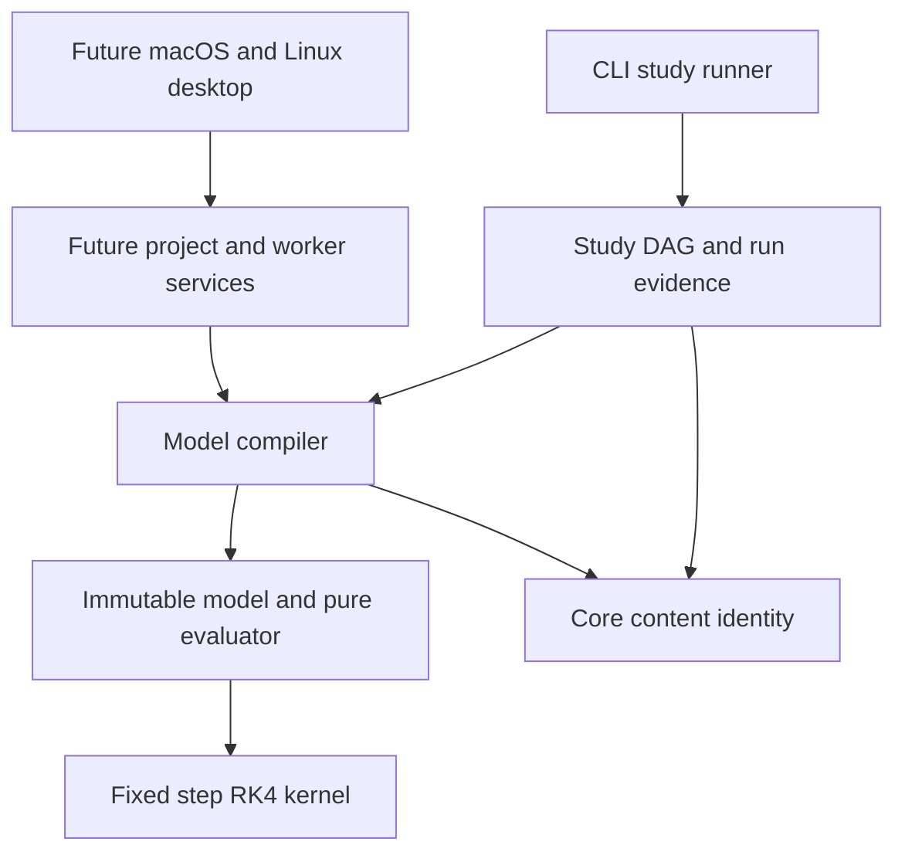

# ADR-0010: A bounded continuous scalar executable model

**Status:** implemented feasibility profile; maintainer and cross-platform
review pending. The broader executable-model architecture remains proposed.

## Context

The study pipeline orders completed engineering operations. A block diagram
instead represents simultaneous signal equations and state evolution, including
feedback. Treating these as the same graph would either reject valid ODE
feedback or silently change its equations. M1 needs an executable experiment
with independent references before expanding into aircraft blocks, sampled
controllers or a desktop editor.

The user selected macOS first, followed by Linux. The first workflow hypothesis
is aircraft/controller diagram authoring, execution and review. The present
increment establishes the shared headless foundation for that workflow; it does
not deliver the complete graphical task or close the external M1 product gates.

## Decision

Introduce `galata::modeling`, below the study pipeline, with a source model,
compiler, immutable resolved model and pure evaluator. Its public contract is
[model.hpp](../../include/galata/modeling/model.hpp); its experimental file
format is [galata.model.v1](../MODEL_FILES.md), execution profile
`continuous-scalar.v1`. The in-memory compiled representation is private and
reconstructed from source, never a portable serialized ABI.

The modeling library does not depend on pipeline, GUI, worker transport, file
system or MATLAB. Its YAML adapter accepts bytes and emits bytes. The core
SHA-256 utility is shared with a compatibility wrapper for the existing
pipeline API; this prevents a model-to-pipeline dependency cycle. YAML is a
private dependency of modeling; Eigen is public because the API exposes its
vectors. Installed CMake exports include `galata::modeling`.

### Source and compilation

The first profile supports finite binary64 scalars and five built-in parameter
variants: Constant, Gain, ordered signed Sum, Integrator and Output. Each block
has a stable ASCII ID and one output. Connections explicitly name a producer,
target and zero-based target input port. Every required port has exactly one
writer. Fan-out and repeated producers at different sum ports are valid.

Every output declares canonical SI dimension exponents and an explicit frame.
The dimensions are length, mass, time, current, temperature, amount, luminous
intensity and an additional semantic angle dimension. Exponents are bounded to
[-16,16]; frames are None, Body and NED. Metadata is checked during compilation;
runtime arithmetic uses ordinary SI doubles under ADR-0003. Scalar frame names
do not establish vector axes or implement rotations. A gain adds its coefficient
dimensions, an integrator multiplies by seconds, and sum/output preserve types.
Conversions, offset units and implicit frame changes are unsupported.

Compilation performs structural/parameter/resource checks, stable-ID resolution,
complete port binding, dimension/frame checking, deterministic state/output
allocation, and instantaneous dependency ordering. Blocks are ordered by ID;
Kahn's algorithm always selects the smallest ready ID. Sum reduction retains
explicit input-port order as a left fold starting at positive zero. Source
connection ordering cannot change arithmetic.

Integrator output depends on its own state, so its input does not create a
direct-feedthrough edge. The input still supplies that state's derivative.
Other input edges retain direct feedthrough even for a zero gain. Any remaining
cycle, including an unobserved one, is refused with an actual source-ID cycle
path found by iterative traversal. No hidden delay, pruning or algebraic solve
is inserted. All admitted blocks are evaluated, including unobserved branches.

Compilation also requires the canonical YAML source to fit the source byte
limit, so a compact input cannot complete simulation and only then discover
that its required evidence cannot be written. The compiler owns a copy of the
validated source. Source mutation does not
alter the compiled model. State/output IDs and schedule are inspectable; their
ordering is stable across source declaration permutations. Both YAML and direct
C++ construction receive full validation, including canonicalization requests.

The decimal adapter uses classic-locale extraction with nearest-even rounding
and restores the caller's floating environment, including exception flags. It
handles representable subnormal range reports explicitly and refuses overflow
or nonzero decimals that round to zero. This preserves older macOS toolchains:
floating-point `std::from_chars` entered libc++ only in LLVM 20, so relying on it
would add a runtime/toolchain floor beyond the existing CI environment.
[LLVM C++17 implementation status](https://libcxx.llvm.org/Status/Cxx17.html).

### Continuous execution

Evaluation takes finite time and a supplied temporary state and returns all
derivatives and declared outputs. Every call uses fresh local signal storage.
It cannot commit state, log accepted samples, read a clock, invoke a user block,
or reuse output from a previous RK stage. Every sum intermediate and block
output must remain finite. All state derivatives refer to the same temporary
state, including coupled feedback systems.

Simulation uses the existing fixed-step RK4 kernel, with its fixed arithmetic
grouping and finite-stage checks. Integer step counts define duration; reported
times are `origin + tick * step`. It records the initial sample, stride
boundaries and the final sample exactly once. Zero steps return one checked
initial sample. Stateless graphs run on the same observation grid without a
fabricated ODE state. The profile requires a positive representable RK step
and distinct finite stage times even for stateless/zero-step requests; this
keeps one run-option validity contract across the profile.

Cancellation is a C++ host callback checked before execution, at each step
boundary and before returning. Cancellation or any invalid numerical stage
throws; no partially successful trajectory is returned. The CLI pipeline has
no asynchronous worker/cancellation protocol yet. A logical work bound is not
an operating-system CPU or memory quota, and cooperative cancellation has no
wall-clock latency guarantee.

### Identity, evidence and bounds

Canonical semantics encode versions, every effective block parameter/type and
connection. Strings are length-delimited; finite binary64 parameters use exact
hexadecimal bits, preserving signed zero. Block and connection declaration
order is excluded; sum port assignments/signs remain included. The semantic
digest identifies the model, independently of run options. Raw source bytes
and runtime/build identity remain in the existing run manifest. Source/project
separation and future migration requirements are in
[ADR-0011](0011-source-model-identity-and-project-boundary.md).

`model.compile` produces an immutable model; `sim.model` consumes it and writes
a CSV and `galata.model-run.v1` evidence record. Evidence includes canonical
source, semantic digest, source maps, solver options and CSV digest. Execution
completion, numerical accuracy, model validity and engineering acceptance are
separate fields. The last three are `not_assessed` by this capability. The
enclosing run manifest identifies exact input/output bytes and build/runtime;
CSV or a stage evidence file alone does not establish completion of a larger
study. Existing per-file atomic publication does not imply a transaction across
all files in a study.

Hard limits are 1 MiB source bytes, 1,024 blocks, 8,192 connections, 64 sum
inputs, 1,000,000 steps, 1,000,000 recorded scalar values including time/state/
output, and 100,000,000 block evaluations including RK substages and observations.
Counts are checked before graph copying or result allocation; multiplication
uses division-based bounds. Work limits count block evaluations, not individual
sum additions. Bounded file roles enforce the source cap during snapshot reads,
before parsing, and again on cached input. YAML rejects aliases/anchors, unknown
keys, duplicate keys, unsupported tags and excessive nesting.

## Verification and consequences

[MODEL_CONFORMANCE.md](../architecture/MODEL_CONFORMANCE.md) predeclares
independent analytic references, discrete RK4 polynomial checks, error budgets,
repeatability, rejection and resource cases. Unit and integration tests implement
those contracts; the existing numerical and evidence suites remain required.
The new capabilities retain `ImplementedUnvalidated` status while platform and
maintainer acceptance remain open. Synthetic conformance does not validate an
aircraft, establish tool qualification or prove arbitrary-step accuracy.

This intentionally defers vectors/buses, nonlinear/aircraft blocks, external
inputs, model references, sampled clocks, events, resets, stiff solvers, state
machines, graphical editing and code generation. Their contracts require new
profiles and independent acceptance cases. The small source/IR separation
permits these additions without making a desktop toolkit part of numerical
execution. Runtime local allocations favor simple, testable ownership at this
stage; a future real-time or high-throughput executor needs measured workloads
and a separate allocation/scheduling contract.

## Subsequent bounded profiles

[ADR-0013](0013-typed-linear-graph-adapter.md) adds the sibling
`continuous-linear.v1` profile — one ordered `linear_combination` block for
matrix rows that couple quantities of different dimensions and coordinate
references, which the deferrals above would otherwise have required erasing
frame information to express. It was admitted through the route this decision
names: a new profile with its own predeclared acceptance cases. The
`continuous-scalar.v1` profile specified here is unchanged; it continues to
reject the new block kind, and its canonical byte contract and frame-equality
checks still hold. Graphical editing is likewise still outside this ADR: the
native preview in [ADR-0012](0012-project-worker-preview.md) edits saved project
documents and delegates all execution to this compiler and runtime.
